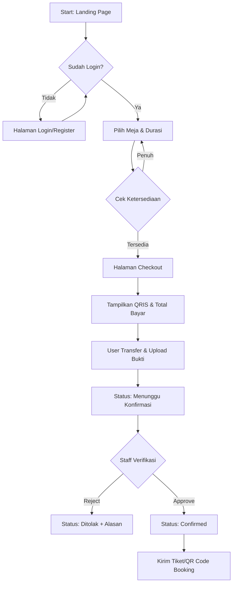

# User Flow Documentation

## 1. Alur Booking & Pembayaran (Customer)

## 2. Alur Pembatalan (Policy)
- **< 24 Jam:** Tidak ada refund.
- **> 24 Jam:** Refund berupa kredit poin (bukan uang tunai).

## 3. Alur Check-in (On-Site)
1. Customer datang tunjukkan Kode Booking.
2. Staff scan/input kode di Dashboard.
3. Status Meja berubah menjadi `Occupied`.
4. Lampu Meja Menyala (Manual/IoT Future).
